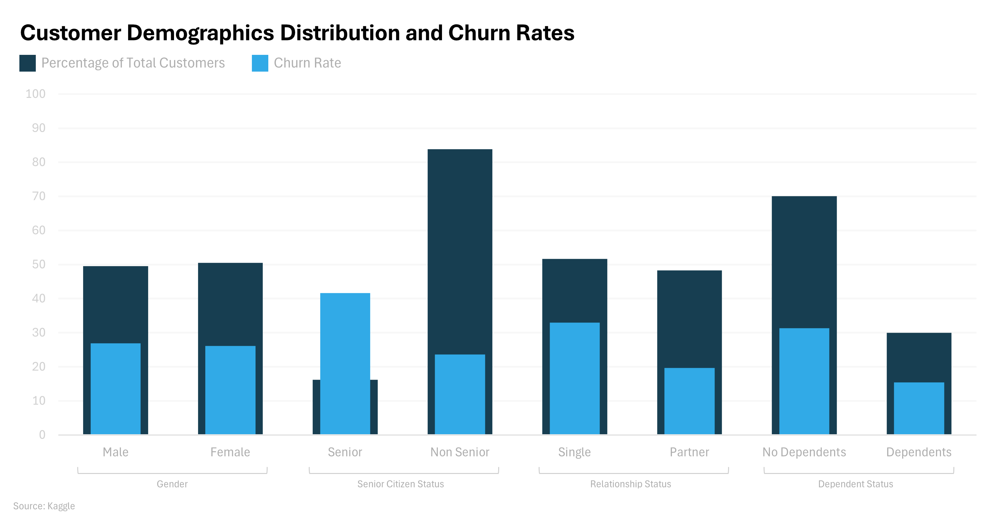

# Customer Churn Analysis for *Fictional Telecommunications Company*
## Table of Contents
- [Business Question](#business-question)
- [Data Source](#data-source)
- [Tools Used](#tools-used)
- [Analysis](#analysis)
- [Insights](#insights)
- [Suggestions](#suggestions)

## Business Question
What customer demographics or business factors are **driving customer churn** at *Fictional Telecommunications Company*, and what strategies can we implement to **improve retention**?

## Data source
[Kaggle Telco Customer Churn Dataset](https://www.kaggle.com/datasets/blastchar/telco-customer-churn)

## Tools Used
- **SQL** 
- **MS Excel**
- **PostgreSQL** 
- **Visual Studio Code** 
- **Git & Github** 

## Analysis

*Nested bar chart showcasing distribution and churn rate across customer demographics*

### 1. Overall Churn Rate
Out of 7043 total customers, 1869 have churned resulting in a churn rate of **26.54%**

### 2. Churn Rate by Gender
The customer base was relatively even in terms of gender, 50.48% male, 49.52% female. The churn rate was also similar across both, 26.16% for males and 26.92% for females

### 3. Churn Rate by Senior Citizen Status
Senior citizens only made up 16.21% of the total customers. However, seniors did account for almost double the churn compared to non-seniors (41.68% vs 23.61%).

### 4. Churn Rate by Partner Status
There was a near even split between customers with and without customers. However, the 51.70% without partners had a much higher churn rate of 32.96% compared to the 19.66% churn for those with partners.

### 5. Churn Rate by Dependent Status
Almost two-thirds of customers reported not having any dependents. This segment of customers also had double the churn rate compared to those who claimed to have dependents. (70.04% no 29.96% yes; 31.28% vs 15.45)

*Radial pie chart highlighting that a majority of customers are independent non-seniors*

### 6. Churn Rate by Phone Service Status
While 90.32% of customers had phone service, there appeared to be no affect on churn rates as churn was 26.71% for those with phone service vs 24.93% for those without.

### 7. Churn Rate by Amount of Lines
A deeper look at the 90.32% of customers with phone service revealed a fairly even split between those with vs without multiple lines (42.18% vs 48.13%). Similar to the previous result, there appeared to be little to no affect on churn. (28.61% vs 25.04%)

### 8. Churn Rate by Internet Service
The company offers two forms of internet service, fiber optic and DSL. 21.67% of customers do not have internet service. As expected, fiber optic is much more popular with 43.96% of customers choosing it over DSL. However, it also has a much higher churn rate associated with it. 41.89% compared to 18.96% churn for customers with DSL internet.

*Nested bar graph showcasing the distribution and churn rates across internet services*

### 9. Churn Rate by Internet Add-Ons
The company also offers six different add-ons for internet service. The most two popular add-ons, movie and tv streaming, also yield the highest churn rates (29.94% and 30.07% respectively). Only 28.67% of customers are signed up for the least popular add-on, online security. However, it does boast the lowest churn rate of all add-ons.

### 10. Churn Rate by Contract Type
The company offers three different contract options: Month-to-month, One year, and Two year. 55.02% of customers are signed up under Month-to-month contracts. However, it does account for almost half of the overall churn. The 2.83% churn rate associated with customers under a two year contract is unsurprising because of the longer committment. 

*Nested bar graph highlighting the correlation between contract type and churn rate*

### 11. Churn Rate by Paperless Billing Status
59.22% of total customers are signed up for paperless billing. These customers also have approximately double the churn rate compared to those who receive their billing statements physically (33.57% vs 16.33%).

### 12. Churn Rate by Payment Method
Of the four available payment method options, electronic check is the most popular. However, customers that pay with electronic check also have the highest churn rate (45.29%). 

*Nested bar graph highlighting the greater churn rate from customers that use electronic check payments.*

### 13. Churn Rate by Charge Amount
Based on the data, there does not appear to be a strong correlation between higher charges leading to higher churn rates. In fact, in the case of total charges, the median charge was much higher for customers who have not churned compared to those who have.
| Charge Type      | Churn | Min Charge | Q1 Charge | Median Charge | Q3 Charge | Max Charge |
|------------------|-------|------------|-----------|---------------|-----------|------------|
| Monthly Charges  | No    | 18.25      | 25.10     | 64.43         | 88.40     | 118.75     |
| Monthly Charges  | Yes   | 18.85      | 56.15     | 79.65         | 94.20     | 118.35     |
| Total Charges    | No    | 18.80      | 577.10    | 1683.00       | 4264.06   | 8672.45    |
| Total Charges    | Yes   | 18.85      | 134.50    | 703.55        | 2331.30   | 8684.80    |

### 14. Churn Rate by Tenure
The data reveals that the highest number of customers (613) were in their first month of tenure with the company. Coincidentally, they also have the highest churn percentage (61.99%). Alternatively, the second largest group of customers is also the longest tenured group. Of the 362 customers with a 72-month tenure, only 1.66% have churned.

*Nested bar graph showcasing distribution and churn rates across tenures*

## Insights
The data provided many interesting insights into the customer base as a whole. Here are the top five key insights I gathered:
1. Senior citizens experience higher churn compared to non-seniors.
2. Single customers without dependents are more likely to churn.
3. Fiber optic customers have double the churn rate compared to DSL customers. This also likely has an impact on why movie and TV streaming having the highest churn rates of all internet add-ons.
4. Longer contract types result in significantly lower churn rates.
5. New customers are at a very high risk of churning.

## Suggestions
1. Utilize exit-survey data from seniors in order to determine how their demographic can be better supported.
2. Consider offering plans or bundles more catered towards single customers without dependents.
3. Conduct customer surveys on fiber optic customers and communicate with the Network Engineering department to work towards improving the quality of service in areas which customers experience dissatisfaction. Improvements here should also positively impact experiences with internet add-ons.
4. Offer incentives or discounts that encourage more customers to opt for longer-term contracts.
5. Develop onboarding and support programs targeted towards new customers, primarily focused on those in their first month.
