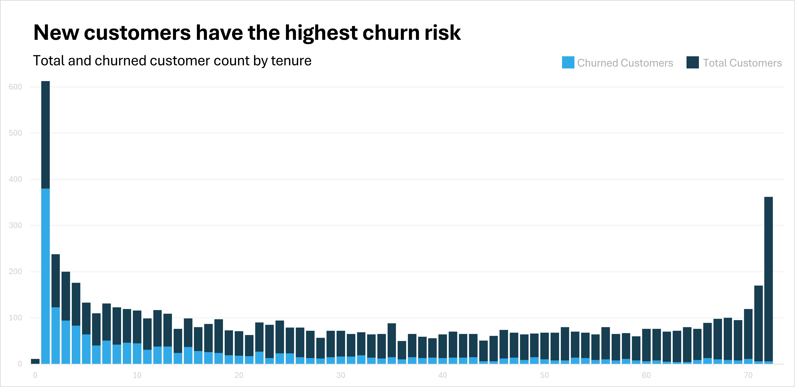

## Table of Contents
- [Background and Overview](#background-and-overview)
- [Data Structure Overview](#data-structure-overview)
- [Executive Summary](#executive-summary)
- [Insights Deep Dive](#insights-deep-dive)
- [Recommendations](#recommendations)

## Background and Overview
AB&C is a *fictional* multinational telecommunications company that provides mobile and fixed-line telephony, broadband, and digital entertainment services. It is one of the largest providers of mobile and internet services in the U.S. and offers a range of communications and media services for consumers and businesses.
 
They are facing a challenge with customer churn, a critical factor impacting its revenue and growth potential. This analysis focuses on identifying the key demographics and business factors contributing to customer churn and explores opportunities to implement data-driven strategies to improve customer retention. 

Insights and recommendations are provided on the following key areas:
- **Customer Demographics**: Evaluation of how factors such as gender, age, dependent/partner status affect churn
- **Service Type**: Analysis of churn across internet service types.
- **Contract & Payment Type**: An assessment of contact and payment type on churn.
- **Tenure**: An evaluation of churn by tenure.

## Data Structure Overview
The analysis was conducted using the [Kaggle Telco Customer Churn Dataset](https://www.kaggle.com/datasets/blastchar/telco-customer-churn). The dataset includes various customer demographics, account information, and service details, offering a comprehensive look into the factors associated with churn.     

View the table column details [here](sql_load/2_create_table.sql)

## Executive Summary
### Summary of Findings
The overall churn rate for the company stands at **26.54%**. Key findings indicate that senior citizens, customers without dependents, and those on month-to-month contracts are at higher risk of churning. Additionally, customers with fiber optic service experience significantly higher churn compared to DSL users. Addressing these factors can reduce churn and improve customer retention.

## Insights Deep Dive
### Customer Demographics

- The customer base was relatively even in terms of gender, 50.48% male, 49.52% female. The churn rate was also similar across both, 26.16% for males and 26.92% for females
- **Senior citizens are 76% more likely to churn than non-seniors.** Seniors account for 16.21% of the customer base but experience a much higher churn rate of 41.68% compared to 23.61% for non-seniors. This group presents a key opportunity for targeted retention efforts.  
- **Single customers without dependents are twice as likely to churn compared to customers with dependents** Customers without partners experience a churn rate of 32.96%, compared to 19.66% for those with partners. Similarly, customers without dependents have a churn rate of 31.28% versus 15.45% for those with dependents.  

### Service Type

- **Fiber optic customers churn at a rate 2.2 times higher than DSL customers.** Fiber optic service customers face a churn rate of 41.89%, significantly higher than the 18.96% churn rate for DSL customers. This suggests that dissatisfaction with fiber optic services may be a contributing factor.  

### Contract & Payment Type

- **Customers with month-to-month contracts are more than 15 times more likely to churn compared to those with two-year contracts.** Month-to-month customers have a churn rate of 42.71%, while customers on one-year and two-year contracts experience far lower churn rates. This indicates that longer contract commitments can improve retention.  
- 59.22% of total customers are signed up for paperless billing. These customers also have approximately double the churn rate compared to those who receive their billing statements physically (33.57% vs 16.33%).

- Of the four available payment method options, electronic check is the most popular. However, customers that pay with electronic check also have the highest churn rate (45.29%). 
- Based on the data, there does not appear to be a strong correlation between higher charges leading to higher churn rates. In fact, in the case of total charges, the median charge was much higher for customers who have not churned compared to those who have.

| Charge Type      | Churn | Min Charge | Q1 Charge | Median Charge | Q3 Charge | Max Charge |
|------------------|-------|------------|-----------|---------------|-----------|------------|
| Monthly Charges  | No    | 18.25      | 25.10     | 64.43         | 88.40     | 118.75     |
| Monthly Charges  | Yes   | 18.85      | 56.15     | 79.65         | 94.20     | 118.35     |
| Total Charges    | No    | 18.80      | 577.10    | 1683.00       | 4264.06   | 8672.45    |
| Total Charges    | Yes   | 18.85      | 134.50    | 703.55        | 2331.30   | 8684.80    |

### Tenure

- **Customers in their first month are 37 times more likely to churn compared to long-tenured customers.** New customers (less than one month tenure) have a churn rate of 61.99%, highlighting the importance of effective onboarding and customer support during the initial period. In contrast, customers with longer tenure, such as 72 months, show significantly lower churn rates (1.66%).  

## Recommendations
1. **Senior Citizen Retention**  
   Leverage exit-survey data and customer feedback to design tailored support initiatives and offers for senior citizens, who experience the highest churn rates.

2. **Targeting Single Customers**  
   Create specialized packages or loyalty programs aimed at single customers without dependents, as they show a significantly higher propensity to churn.

3. **Improving Fiber Optic Services**  
   Survey fiber optic customers to gather insights on service quality issues. Collaborate with the Network Engineering team to address dissatisfaction and improve customer experiences, particularly in areas with high churn rates.

4. **Incentivize Longer Contracts**  
   Offer discounts or other incentives to encourage customers to switch from month-to-month to longer-term contracts, which show significantly lower churn rates.

5. **Enhance Onboarding for New Customers**  
   Develop a robust onboarding program that offers additional support to customers during their first month, where churn rates are highest. A focus on personalized customer engagement can greatly reduce early churn.
